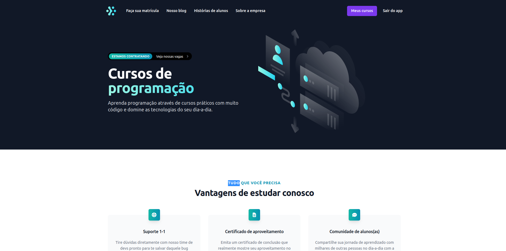
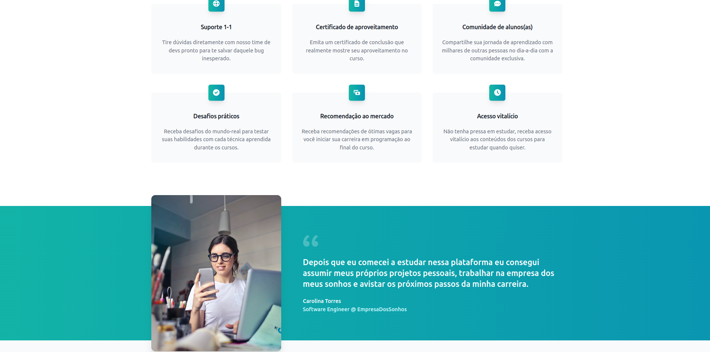
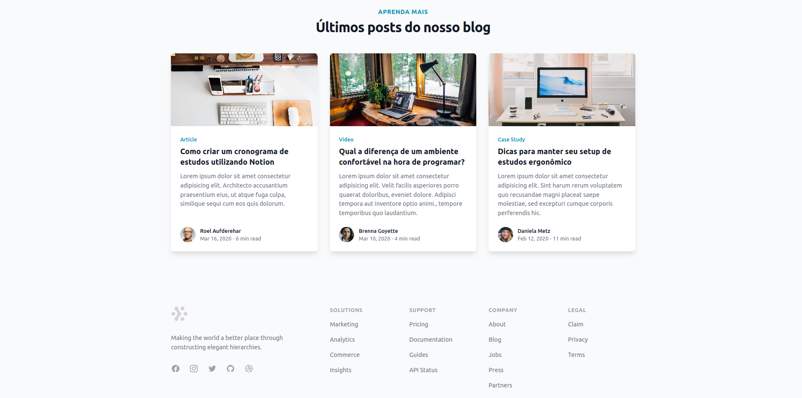
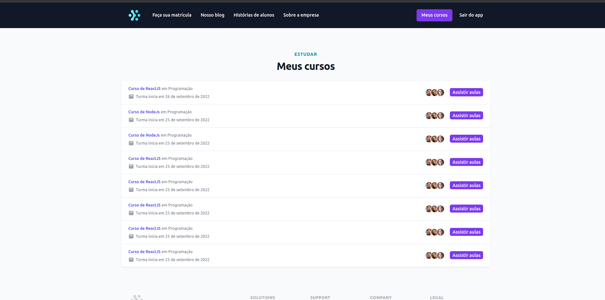
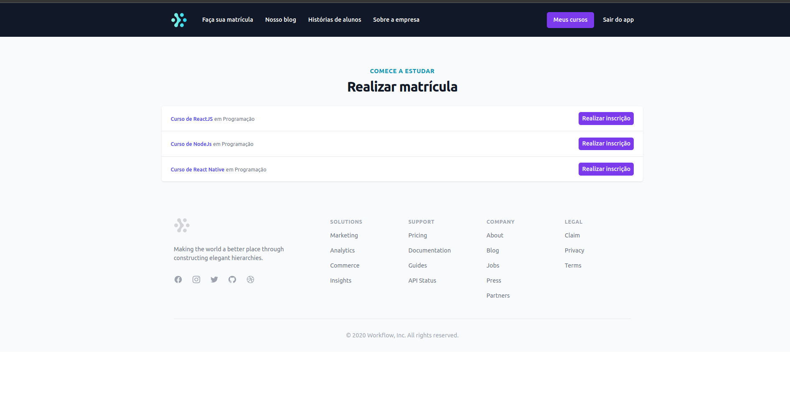

# Ignite Lab 01

<div>
  
  
  
  
  
</div>


<br/>

## 🛠️ Tecnologias/Ferramentas ultilizadas
<br/>

### Front-End
 - NextJS
 - Typescript 
 - Tailwind 

### Back-End
 - NestJS
 - Typescript
 - Auth0 (Autenticação terceiro) 
 - Docker 
 - Prisma 
 - GraphQL
 - Apache Kafka
 - Apollo Client (GraphQL)
 - Apollo Federation (GraphQL)

<br/>

## 📚 Informações sobre o projeto

## Aula 01 
Nessa primeira aula vamos criar a base dos micro-serviços back-end e a estrutura front-end do nosso projeto. Vamos também fazer o setup do processo de autenticação usando o Auth0, a estrutura da base de dados com Prisma e os fundamentos da nossa API com GraphQL.

Ferramentas: NestJS, Docker, Prisma, Auth0, GraphQL.

## Aula 02

Nessa aula vamos construir toda estrutura GraphQL e funcionalidades back-end da nossa aplicação. Vamos criar os resolvers, queries, models e inputs do GraphQL para as funcionalidades do serviço de compras e sala de aula.

Ferramenta: GraphQL.

## Aula 03

Nessa aula vamos integrar nossos serviços com apache kafka e entender como o Apollo Federation poderá nos ajudar a lidar com vários schemas diferentes no GraphQL.

Ferramenta: Apache Kafka e Apollo Federation.

## Aula 04

Nessa aula vamos integrar nosso front-end com nossos serviços back-end utilizando Apollo Client e GraphQL CodeGen. Vamos aprender como realizar requisições GraphQL tanto pelo client-side quanto pelo server-side e também como realizar autenticação das requisições construindo um proxy de requisições HTTP dentro do Next.js.

## Aula 05

Finalizando a aplicação.


## 🖼️ Funcionalidades


### Serviço de compras (purchases)

- [Admin] Cadastro de produtos
- [Admin] Listagem de produtos

- [Auth] Listagem de compras

- [Public] Compra de um produto
- [Public] Lista produtos disponíveis p/ compra

### Serviço de sala de aula (classroom)

- [Admin] Listar matrículas
- [Admin] Listar alunos
- [Admin] Listar cursos
- [Admin] Cadastrar cursos

- [Auth] Listar cursos que tenho acesso
- [Auth] Acessar conteúdo do curso

----------------------------------------------------------------

<p>[ X ] Importar telas do Tailwind</p>
<p>[ X ] URL de Logout no Auth0</p>
<p>[ X ] Query das minhas matrículas</p>
<p>[ X ] Query de produtos</p>
<p>[ X ] Mutation de realizar matrícula</p>

--- 

## ⚙️ Instalação

```
# Abra um terminal e copie este repositório com o comando
$ git clone https://github.com/Hugovarellaa/ignite-lab-01
```

```
# Acesse a pasta da aplicação

# Instale Docker
https://www.notion.so/Docker-e-Docker-Compose-16771f2ceefe4a05a8c29df4ca49e97a

# Inicie o docker e Apache Kafka
$ $ docker-componse up -p

# Instale as dependências de cada projeto usando npm ou yarn
$ npm install 
$ yarn 

# Suba os back-end
$ npm run start:dev

# Inicie a aplicação web 
$ yarn dev


```
